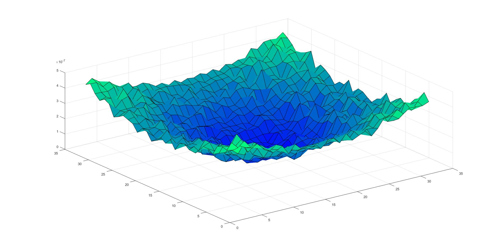
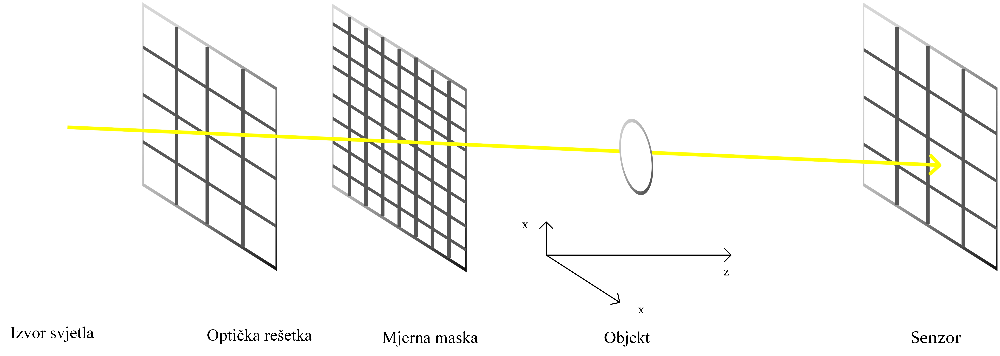
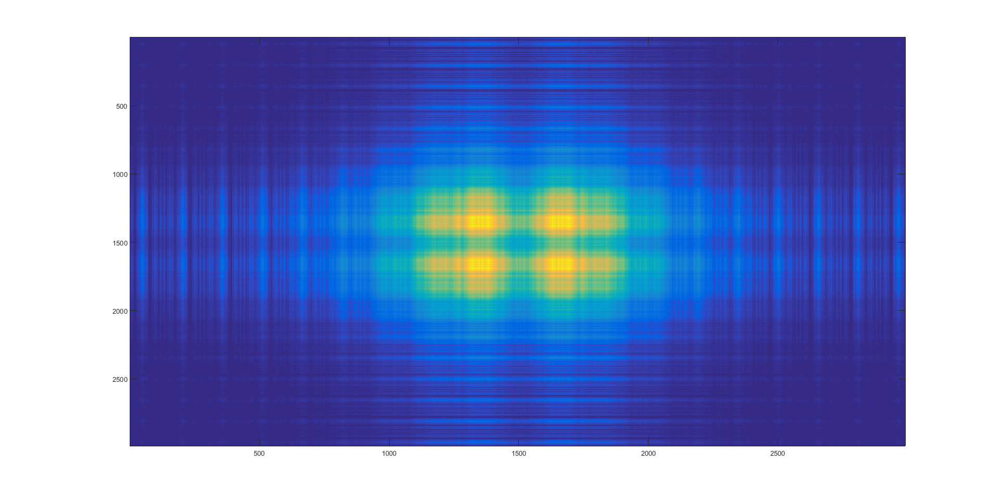
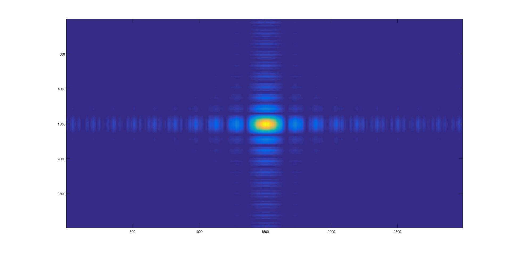

# Coherent Optical System Model

**Laser microscopy, phase-based imaging, and compressive sensing in MATLAB.**

This master's thesis models coherent light passing through a transparent object and reconstructs its effect from optical-grid measurements. Its key extension is **compressive sensing**: coded optical masks and sparse recovery reveal structure within each grid opening.

Developed by **Josip Vukušić** at the **University of Zagreb, Faculty of Electrical Engineering and Computing (FER)**, 2017. Supervisor: **Prof. Damir Seršić**. The implementation includes contributions by **Ana Škaro**.

**[See the results](#results-at-a-glance)** · **[Explore the method](#the-secret-sauce-compressive-sensing)** · **[Run in MATLAB](#getting-started)** · **[Read the thesis](docs/thesis/josip-vukusic-masters-thesis-2017.pdf)**

## Results at a glance

**32 coded measurements → 64 reconstructed values per grid opening.**

The thesis demonstrates a reconstruction with an **8 × 8 detail grid inside each opening** of a coarse **4 × 4 optical grid**. Together, those local reconstructions form a **32 × 32 map**.

| In the compressive-sensing experiment | Result |
| :--- | :--- |
| Coded measurements per opening | **32** centroid measurements, each providing x and y components |
| Reconstructed values per opening | **64 per component**, arranged as 8 × 8 |
| Assembled reconstruction | **32 × 32 = 1,024 spatial samples per component** |
| Sampling gain over one value per opening | **64× more spatial samples**, or **8× along each axis** |
| Reconstruction method | **DCT representation + ℓ₁ minimization**, solved with SeDuMi |



*Original thesis, Figure 5.11: reconstructed centroid-displacement magnitude, used in phase-gradient estimation. The overall bowl-shaped structure remains visible after reconstruction from fewer measurements than unknown spatial values.*

These are **synthetic experiments reported in the 2017 thesis**. The 64× figure describes the number of reconstructed spatial samples relative to the coarse grid; it is not a measured 64× improvement in optical resolving power. [Explore all results, timings, and limitations →](docs/results.md)

## Compressive sensing

An ordinary attenuation grid gives one local displacement estimate per opening. **The extra measurement mask changes what is possible.** By selectively transmitting light through smaller regions inside each opening, it creates a sequence of coded observations of the same object.

The reconstruction uses the assumption that the underlying signal has a compact representation in a transform basis. Here, a **discrete cosine transform (DCT)** provides that representation, and **ℓ₁ minimization** searches for sparse coefficients consistent with the measurements.

$$
y = \Phi x = \Phi\Psi s,
\qquad
\hat{x} = \Psi\hat{s}.
$$

$$
\hat{s} = \underset{s}{\arg\min}\;\|s\|_1
\quad\text{subject to}\quad \Phi\Psi s = y.
$$

Here, **Φ** describes the masks, **Ψ** is the synthesis dictionary, **s** contains its coefficients, and **y** holds the measurements. The implementation reconstructs the x and y displacement components separately, then assembles the local results into larger maps.

For each component, the featured experiment uses **32 measurements for 64 unknown values**. Each balanced binary mask also has **50% of its elements open**. Those are two distinct design choices: how many measurements to take, and how much of each mask transmits light.



*Original thesis, Figure 5.9. Left to right: light source → attenuation grid → measurement mask → transparent object → sensor. The original Croatian labels are preserved.*

[Follow the physics and reconstruction step by step →](docs/method.md)

## From wave optics to reconstruction

The project connects three parts of computational imaging:

1. **Model the light.** Propagate a coherent field using the Huygens–Fresnel principle, the Fresnel approximation, and Fourier-domain computation.
2. **Make a transparent object measurable.** Model its thickness as a phase modulation, then measure the shifts it produces in the grid's diffraction patterns.
3. **Recover finer detail.** Add coded masks and sparse reconstruction to estimate structure within each grid opening.

| Diffraction through an aperture | Focusing with a converging lens |
| :---: | :---: |
|  |  |

*Original thesis, Figures 5.2 and 5.4. These experiments establish the wave-propagation and object models that the reconstruction builds on. The scripts display field magnitude, `abs(U)`.*

## Getting started

Start with the single-aperture experiment. From the repository root in MATLAB:

```matlab
optical_system
```

Then explore the lens experiment:

```matlab
optical_system_with_object
```

For the compressive-sensing experiment, you also need **Wavelet Toolbox** with `wmpdictionary` and a working **SeDuMi** installation. After checking those prerequisites:

```matlab
addpath('dependencies');
addpath(genpath(fullfile('dependencies', 'SeDuMi_1_3')));
optical_system_compressive_sensing2
```

The original research scripts and bundled solver are preserved. Current MATLAB compatibility has not been verified; the CS run is computationally intensive and saves its masks, reference centers, and object-window array in the current folder. The [MATLAB guide](docs/getting-started.md) explains setup, experiment entry points, saved defaults, and known legacy dependencies.

## Explore the research

| Resource | What you will find |
| :--- | :--- |
| [Results gallery](docs/results.md) | Original figures, the 32-to-64 reconstruction, historical timings, and limitations |
| [Method walkthrough](docs/method.md) | Fresnel propagation, transparent-object modeling, grid sensing, and sparse recovery |
| [MATLAB guide](docs/getting-started.md) | Requirements, commands, script map, and reproducibility notes |
| [Research poster · image](docs/assets/research-poster-2017.png) | One-page overview presented at FER's 2017 master's workshop |
| [Figure sources](docs/assets/README.md) | Provenance of the original images and research documents |

The MATLAB experiments remain at the repository root, their supporting routines in `dependencies/`, and the research presentation in `docs/`.

## Citation and credits

If this work informs your research, please cite the thesis:

> Josip Vukušić. *Model koherentnog optičkog sustava korištenog u laserskoj mikroskopiji*. Master's thesis no. 1469, University of Zagreb, Faculty of Electrical Engineering and Computing, 2017.

[CITATION.cff](CITATION.cff) provides machine-readable citation metadata. The English title is *Coherent Optical System Model Used in Laser Microscopy*.

**Thesis author:** Josip Vukušić · **Code contributors:** Josip Vukušić and Ana Škaro · **Supervisor:** Prof. Damir Seršić.

The research builds on Fourier optics, attenuation-grid phase imaging, and compressive sensing. See the [method references](docs/method.md#references) and [third-party acknowledgments](THIRD_PARTY_NOTICES.md). No repository-wide license has been declared; bundled components retain their own notices.

Questions, reproduction reports, and documentation improvements are welcome. See [CONTRIBUTING.md](CONTRIBUTING.md).
