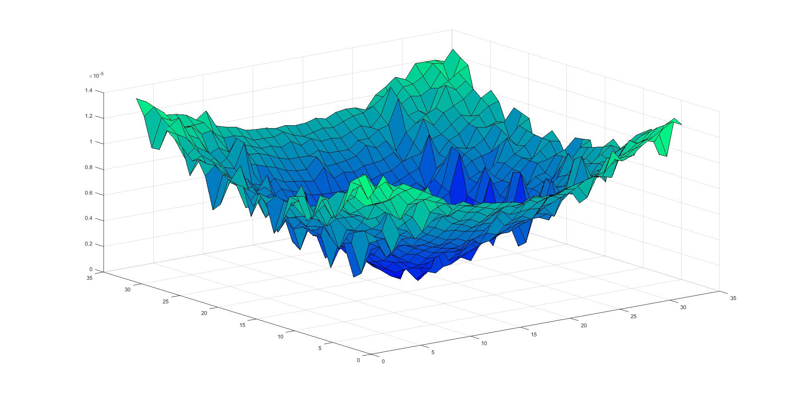
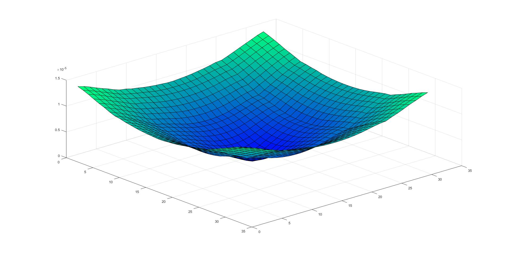

# Results: from diffraction to compressive reconstruction

[← Project overview](../README.md) · [Method](method.md) · [MATLAB guide](getting-started.md)

The figures below are original exports from Josip Vukušić's 2017 master's thesis. They document synthetic experiments with the coherent optical model. References use **printed thesis page numbers**; the corresponding PDF page is five pages later because of the front matter.

## The headline experiment: 32 measurements, 64 values

A coarse **4 × 4 attenuation grid** provides 16 openings. Within every opening, an **8 × 8 measurement mask** selects smaller regions through which light can pass. The model takes **32 coded centroid measurements per opening**, each with an x and a y component, and reconstructs **64 values for each component** using a DCT dictionary and ℓ₁ minimization.

| Quantity | How it is obtained |
| :--- | :--- |
| 16 coarse openings | 4 × 4 attenuation grid |
| 64 spatial values per opening, per component | 8 × 8 local reconstruction |
| 32 measurements per opening, per component | One x and one y displacement from each coded pattern |
| 1,024 output samples per component | (4 × 8) × (4 × 8) = 32 × 32 |
| 64× more output samples than the coarse grid | 1,024 / 16; equivalently, 8× along each axis |
| 50% measurement-to-unknown ratio per component | 32 / 64 |

The 32 measurements are repeated for every opening; they are not 32 scalar measurements for the entire image. The implementation also calculates a separate reference centroid for every mask without the object present.

### Balanced random masks

**What to look for:** the reconstruction retains the broad, smooth bowl-shaped structure of the displacement signal, with visible local fluctuations. This is the thesis's featured demonstration of finer spatial sampling through compressive sensing.

**Configuration:** 32 masks per opening, 50% open mask elements, DCT representation, ℓ₁ reconstruction. **Source:** thesis §5.3, pp. 28–30, Figure 5.11. The thesis calls the random masks Gaussian-derived; the preserved implementation in [balanced_random.m](../balanced_random.m) instead explicitly constructs binary masks by shuffling equal numbers of zeros and ones. The documentation uses “balanced random masks” to describe that implementation precisely.

### A second sensing strategy: selected identity rows

The thesis also reconstructs from **32 randomly selected rows of an identity measurement matrix**, using the same DCT representation. The broad structure is visible, alongside pronounced local irregularities. This provides a second illustration of how the sensing pattern affects the reconstructed surface. **Source:** thesis §5.3, p. 29, Figure 5.10.

### Conventional grid reconstruction

The conventional grid experiment measures how the object shifts the centers of the diffraction patterns. This figure supplies the qualitative reference for the CS experiments. **Source:** thesis §5.2, pp. 25–28, Figure 5.8.

**Reading the three surfaces:** the original plots use different vertical scales and configurations. They support a comparison of overall shape, not an amplitude-matched error comparison. The plotted quantity is a centroid-displacement signal; these surfaces are not direct maps of object thickness. The reported CS results do not include a numerical PSNR, SSIM, or reconstruction-error benchmark.

## Establishing the optical model

### Aperture diffraction

Light passing through a square aperture produces the expected interference fringes. The model propagates the complex field through the Fresnel transfer function in the Fourier domain. **Source:** thesis §5.1, pp. 21–23, Figure 5.2; [optical_system.m](../optical_system.m).

### Lens focusing

Introducing a transparent converging lens concentrates the field near the center. The lens enters the model as a thickness-dependent phase transformation. **Source:** thesis §5.1, pp. 23–25, Figure 5.4; [optical_system_with_object.m](../optical_system_with_object.m).

The scripts plot **field magnitude, `abs(U)`**, and use that quantity in centroid calculations. Optical intensity is proportional to **`abs(U).^2`**; the original thesis and some source comments use “intensity” more broadly. The original plots and computations are preserved.

## Historical execution times

| Experiment | Time reported in the thesis | Source |
| :--- | ---: | :--- |
| Single-aperture diffraction | 2.573006 s | §5.1, p. 22 |
| Conventional grid reconstruction | 49.06 s, average | §5.2, p. 27 |
| CS reconstruction with 32 random masks | 2,128.71 s, about 35.5 min | §5.3, p. 30 |

These are historical timings from different experiments. They have not been rerun for this presentation, and the cited passages do not supply enough machine and software details for a controlled performance comparison. No speedup ratio is inferred from them.

## What the work establishes

The project brings diffraction, transparent-object modeling, grid-based sensing, and sparse recovery into one simulation. Its distinctive result is a **finer reconstruction grid obtained by coding measurements within the existing optical openings**. The original figures make the feasibility of that approach visible for the studied object.

The thesis's discussion (§6, p. 31) identifies three practical directions for improvement:

- **Computation:** repeated propagation for each opening and mask dominates the CS experiment. Independent windows offer opportunities for parallel execution.
- **Centroid accuracy:** diffraction fringes and the integration window affect the measured center, introducing reconstruction error.
- **Choice of dictionary:** the transform that represents one object's displacement field well may be less suitable for a different object.

The 64× sampling gain is specific to this grid configuration. It is not a guarantee of exact recovery for arbitrary objects, a measurement of diffraction-limited resolving power, or a validation on physical microscope data. The [MATLAB guide](getting-started.md#saved-defaults-and-thesis-settings) also records differences between the thesis settings and the current source defaults.

[Read the complete thesis](thesis/josip-vukusic-masters-thesis-2017.pdf) · [View the defense slides](thesis/defense-slides-2017.pdf)
